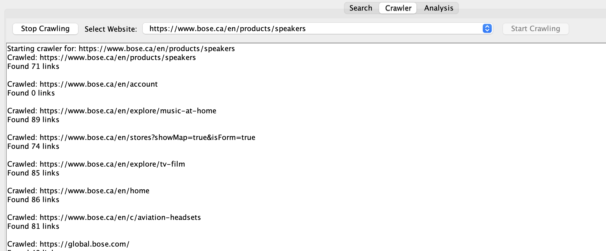
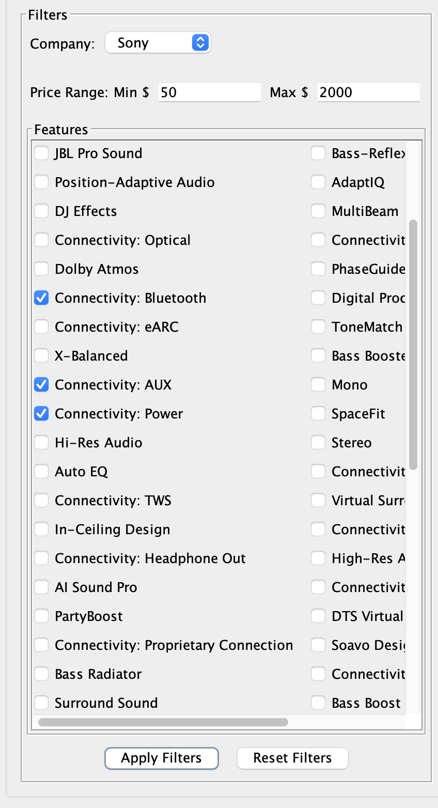
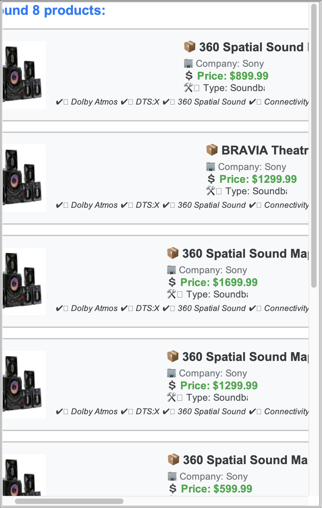
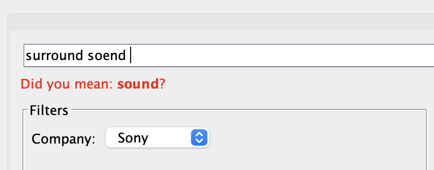
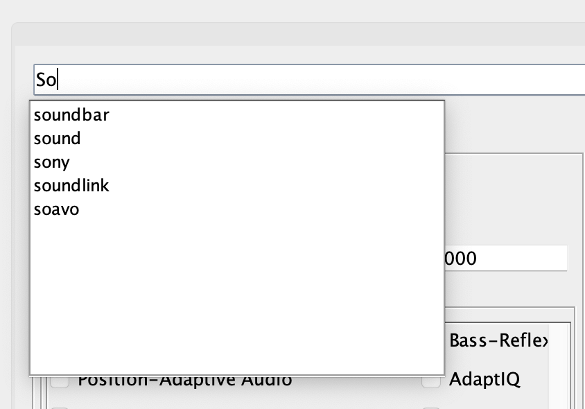
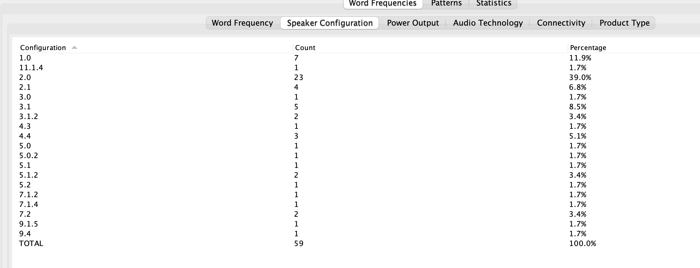
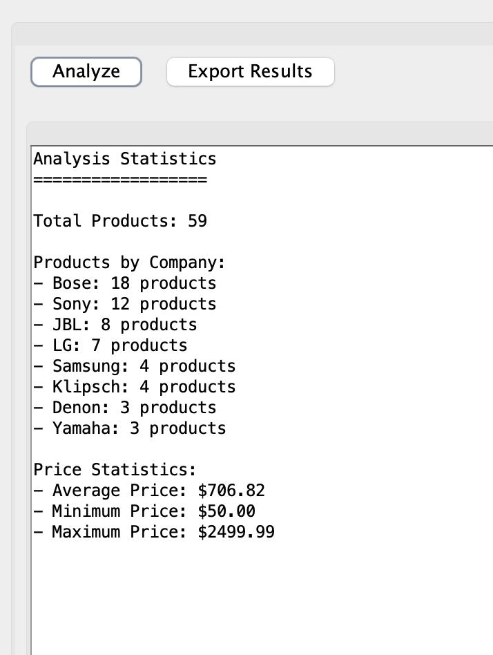
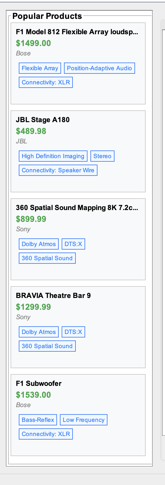
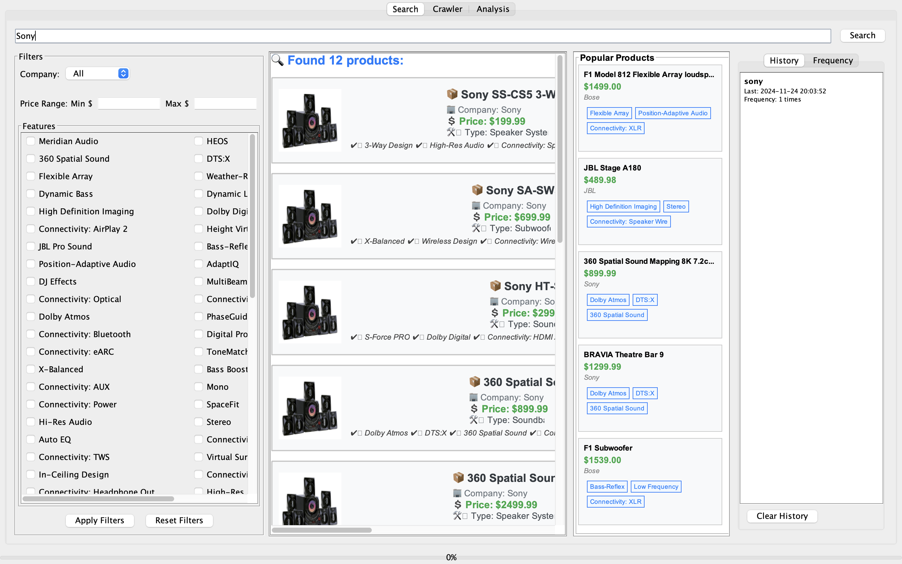
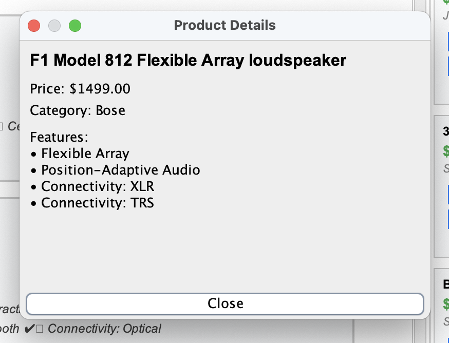

# Home Theatre System Search and Analysis Engine

## COMP - 8547 - ADVANCE COMPUTING CONCEPTS
### FALL - 2024
### GROUP - 9


---

## Project Description

### Overview
The Home Theatre System Search and Analysis Engine is a specialized search engine designed to analyze and compare various home theatre systems based on different features and user preferences. The system crawls major manufacturer websites, indexes product information, and provides advanced search and analysis capabilities.

### Target Websites
- Bose (www.bose.ca)
- Sony (www.sony.ca)
- LG (www.lg.com)
- Samsung (www.samsung.com)
- JBL (www.jbl.com)
- Denon  (www.denon.com)

### Core Features
1. Web Crawler System
2. HTML Parser
3. Spell Checking Engine
4. Word Completion System
5. Frequency Analysis
6. Search History Tracking
7. Page Ranking Algorithm
8. Inverted Indexing
9. Pattern Recognition
10. Data Validation System

### Additional Features
1. History Management
    - Track user search history
    - Save and restore search sessions
    - Analyze search patterns

2. Statistical Analysis
    - Search trend analysis
    - User behavior insights

3. Popular Products Tracking
    - Top searched products
    - Trending categories

4. Advanced Caching System
    - Intelligent page caching
    - Cache expiration management
    - Memory optimization
    - Performance monitoring

5. Smart Filtering System
    - Price range filtering
    - Feature-based filtering
    - Brand filtering
    - Rating-based filtering
    - Advanced combination filters

### Technical Specifications
- Language: Java
- Build System: Custom Shell Script
- Dependencies:
    - Selenium WebDriver
    - JSoup HTML Parser
    - Google Gson
    - Regular Expressions

### Project Objectives
1. Create a comprehensive database of home theatre systems
2. Provide accurate search results with spelling suggestions
3. Implement advanced filtering and comparison features
4. Track user search patterns and preferences
5. Generate detailed product analytics and insights
6. Optimize search performance through caching
7. Deliver personalized search experience

### Team Contribution

RAJKUMAR's Contributions:
- Web Crawler (WebCrawler.java, CrawlerConfig.java)
- Caching System (CacheConfig.java, PageCache.java)
- Search Filters Implementation (SearchEngine.java)

VANSH's Contributions:
- HTML Parser (HTMLParser.java)
- Data Validation System (DataValidator.java)
- Spell Checking Engine (SpellChecker.java)

MIT's Contributions:
- Word Completion System (WordCompletion.java, TrieNode.java)
- Frequency Analysis (FrequencyAnalyzer.java)
- Search Frequency Tracking (SearchPanel.java)

BHARGAV's Contributions:
- Page Ranking Algorithm (PageRanker.java)
- Inverted Indexing (InvertedIndex.java)
- Pattern Recognition (PatternFinder.java, PatternMatch.java)

KIRTAN's Contributions:
- History Management System (History part in SearchPanel.java)
- Statistical Analysis Components (Statistics part in AnalysisPanel.java)
- Popular Products Tracking System (SearchPanel.java)

# Data Structures and Algorithms Analysis

## 1. Web Crawler (RAJKUMAR)
### Data Structures
- **ConcurrentHashMap<String, WebPage>**
   - Purpose: Thread-safe storage of crawled pages
   - Time Complexity: O(1) for lookups and insertions
```java
private final Map<Long, WebDriver> drivers = new ConcurrentHashMap<>();
private final Set<String> visitedUrls = Collections.newSetFromMap(new ConcurrentHashMap<>());
```

- **Queue<String>**
   - Purpose: URL frontier management
   - Implementation: LinkedBlockingQueue for thread safety
```java
private final Queue<String> pendingUrls = new LinkedBlockingQueue<>();
```

### Algorithms
- **Breadth-First Search (BFS)**
   - Used for crawling web pages in level-order
   - Depth tracking for limiting crawl depth
```java
private void processCrawlRequest(String url) {
    if (currentDepth <= maxDepth) {
        WebPage page = crawlPage(url);
        for (String link : page.getLinks()) {
            if (!visitedUrls.contains(link)) {
                pendingUrls.offer(link);
            }
        }
    }
}
```

## 2. Caching System (RAJKUMAR)
### Data Structures
- **LRU Cache Implementation**
   - Using LinkedHashMap for O(1) access and removal
```java
private final Map<String, CacheEntry> memoryCache;
private final int maxEntries = 1000;

class CacheEntry {
    private final WebPage page;
    private final long timestamp;
}
```

### Algorithms
- **Cache Eviction Strategy**
   - LRU (Least Recently Used) implementation
   - Time-based expiration using timestamps
```java
private void evictStaleEntries() {
    long currentTime = System.currentTimeMillis();
    memoryCache.entrySet().removeIf(entry -> 
        currentTime - entry.getValue().getTimestamp() > cacheExpirationMs);
}
```

## 3. HTML Parser (VANSH)
### Data Structures
- **DOM Tree**
   - JSoup's document object model
```java
private static Product extractProduct(Element element, CompanySelectors selectors) {
    Product product = new Product();
    Elements features = element.select(selectors.featureSelector);
    Elements specs = element.select("dl.specifications dt, dl.specifications dd");
}
```

- **Regular Expression Patterns**
   - Compiled patterns for data extraction
```java
private static final Pattern PRICE_PATTERN = Pattern.compile("\\$\\s*(\\d+(?:,\\d+)?(?:\\.\\d{2})?)");
```

## 4. Spell Checking Engine (VANSH)
### Data Structures
- **HashSet<String>**
   - Purpose: Vocabulary storage
   - Time Complexity: O(1) for lookups
```java
private final Set<String> vocabulary = new HashSet<>();
```

- **Dynamic Programming Matrix**
   - Used for Edit Distance calculation
```java
private int[][] calculateEditDistanceMatrix(String s1, String s2) {
    int[][] dp = new int[s1.length() + 1][s2.length() + 1];
    // Matrix initialization and calculation
    return dp;
}
```

### Algorithms
- **Levenshtein Distance Algorithm**
   - Time Complexity: O(m*n)
   - Space Complexity: O(min(m,n))
```java
private int calculateEditDistance(String s1, String s2) {
    int[] prev = new int[s2.length() + 1];
    int[] curr = new int[s2.length() + 1];
    // Edit distance calculation
}
```

## 5. Word Completion System (MIT)
### Data Structures
- **Trie (Prefix Tree)**
   - Custom implementation for prefix-based lookups
```java
class TrieNode {
    private Map<Character, TrieNode> children;
    private boolean isEndOfWord;
    private int frequency;
    private Set<String> productIds;
}
```

### Algorithms
- **Prefix Search Algorithm**
   - Time Complexity: O(L) for lookups where L is word length
```java
public List<Suggestion> getSuggestions(String prefix) {
    TrieNode current = root;
    for (char ch : prefix.toCharArray()) {
        current = current.getChildren().get(ch);
        if (current == null) return Collections.emptyList();
    }
    return findAllWords(current, prefix);
}
```

## 6. Page Ranking (BHARGAV)
### Data Structures
- **PriorityQueue<RankedProduct>**
   - Maintains top-N ranked results
```java
PriorityQueue<RankedProduct> rankedProducts = new PriorityQueue<>(
    (p1, p2) -> Double.compare(p2.getScore(), p1.getScore())
);
```

### Algorithms
- **TF-IDF Scoring**
   - Term Frequency-Inverse Document Frequency
```java
private double calculateTFIDF(String term, Product product) {
    double tf = calculateTermFrequency(term, product);
    double idf = calculateInverseDocumentFrequency(term);
    return tf * idf;
}
```

## 7. Inverted Index (BHARGAV)
### Data Structures
- **HashMap<String, IndexEntry>**
   - Maps terms to their occurrences
```java
private final Map<String, IndexEntry> index = new ConcurrentHashMap<>();

class IndexEntry {
    private final Map<String, PostingList> postings;
    private int documentFrequency;
}
```

### Algorithms
- **Index Construction**
   - Time Complexity: O(N*M) where N is terms and M is documents
```java
private void indexProduct(Product product) {
    String[] terms = tokenize(product.getName() + " " + product.getDescription());
    for (String term : terms) {
        index.computeIfAbsent(term, k -> new IndexEntry())
             .addOccurrence(product.getProductId(), 1.0);
    }
}
```

## 8. History Management (KIRTAN)
### Data Structures
- **LinkedHashMap<String, SearchTerm>**
   - Maintains search history in order
```java
private final Map<String, SearchTerm> searchHistory = new LinkedHashMap<String, SearchTerm>() {
    protected boolean removeEldestEntry(Map.Entry eldest) {
        return size() > MAX_HISTORY_SIZE;
    }
};
```

## 9. Statistical Analysis (KIRTAN)
### Data Structures
- **TreeMap<Date, Integer>**
   - Time-series data for trend analysis
```java
private final NavigableMap<Date, Integer> searchTrends = new TreeMap<>();
```

### Algorithms
- **Moving Average Calculation**
   - For trend analysis
```java
private double calculateMovingAverage(List<Integer> values, int window) {
    return values.stream()
           .skip(Math.max(0, values.size() - window))
           .mapToInt(Integer::intValue)
           .average()
           .orElse(0.0);
}
```

## Performance Analysis
### Space Complexity
- Web Crawler: O(N) where N is number of URLs
- Trie: O(ALPHABET_SIZE * L * N) where L is avg word length
- Inverted Index: O(T * D) where T is terms and D is documents
- Cache: O(C) where C is cache size limit

### Time Complexity
- Spell Checking: O(M * N) for edit distance
- Word Completion: O(L) for prefix search
- Page Ranking: O(N log N) for sorting results
- Search: O(Q * L) where Q is query terms and L is posting list length


# Additional Features: Data Structures and Algorithms Analysis

## 1. History Management System (KIRTAN)
### Data Structures
- **LRU Cache with Timestamps**
```java
public class HistoryManager {
    private final LinkedHashMap<String, SearchHistory> searchHistory;
    private static final int MAX_HISTORY = 1000;

    public class SearchHistory {
        private final String query;
        private final LocalDateTime timestamp;
        private final Set<String> results;
        private int accessCount;
    }

    public HistoryManager() {
        this.searchHistory = new LinkedHashMap<>(MAX_HISTORY, 0.75f, true) {
            @Override
            protected boolean removeEldestEntry(Map.Entry<String, SearchHistory> eldest) {
                return size() > MAX_HISTORY;
            }
        };
    }
}
```

### Algorithms
- **History Cleanup Algorithm**
```java
private void cleanupOldEntries() {
    LocalDateTime cutoff = LocalDateTime.now().minusDays(30);
    searchHistory.entrySet().removeIf(entry -> 
        entry.getValue().getTimestamp().isBefore(cutoff));
}
```

## 2. Statistical Analysis System (KIRTAN)
### Data Structures
- **Time Series Data Structure**
```java
public class StatisticsManager {
    private final TreeMap<LocalDateTime, StatisticalData> timeSeriesData;
    private final Map<String, ProductStatistics> productStats;

    class StatisticalData {
        private final Map<String, Integer> searchFrequency;
        private final Map<String, Double> avgResponseTime;
        private final Map<String, Integer> clickThrough;
    }
}
```

- **Aggregation Cache**
```java
private final Map<String, AggregatedStats> aggregatedCache = new ConcurrentHashMap<>();

class AggregatedStats {
    private final double avgSearchTime;
    private final int totalSearches;
    private final Map<String, Integer> popularTerms;
    private final LocalDateTime lastUpdated;
}
```

### Algorithms
- **Moving Average Calculation**
```java
public double calculateMovingAverage(String metric, int windowSize) {
    List<Double> values = timeSeriesData.values().stream()
        .map(data -> data.getMetric(metric))
        .limit(windowSize)
        .collect(Collectors.toList());
        
    return values.stream()
        .mapToDouble(Double::doubleValue)
        .average()
        .orElse(0.0);
}
```

## 3. Popular Products Tracking (KIRTAN)
### Data Structures
- **Heap-based Priority Queue**
```java
public class PopularProductsTracker {
    private final PriorityQueue<ProductPopularity> topProducts;
    private final Map<String, ProductPopularity> productMap;

    class ProductPopularity {
        private final String productId;
        private int viewCount;
        private int searchCount;
        private LocalDateTime lastViewed;
        private double popularityScore;
    }

    public PopularProductsTracker() {
        this.topProducts = new PriorityQueue<>((p1, p2) -> 
            Double.compare(p2.getPopularityScore(), p1.getPopularityScore()));
        this.productMap = new ConcurrentHashMap<>();
    }
}
```

### Algorithms
- **Popularity Score Calculation**
```java
private double calculatePopularityScore(ProductPopularity product) {
    long recencyWeight = ChronoUnit.HOURS.between(
        product.getLastViewed(), 
        LocalDateTime.now()
    );
    
    return (product.getViewCount() * 0.4 + 
            product.getSearchCount() * 0.6) * 
            Math.exp(-0.01 * recencyWeight);
}
```

## 4. Advanced Caching System (RAJKUMAR)
### Data Structures
- **Multi-Level Cache**
```java
public class MultiLevelCache {
    private final Map<String, CacheEntry> l1Cache;  // Memory Cache
    private final Map<String, CacheEntry> l2Cache;  // Disk Cache
    private final Set<String> evictionQueue;

    class CacheEntry {
        private final byte[] data;
        private final long timestamp;
        private final int accessCount;
        private final CachePolicy policy;
    }

    public MultiLevelCache() {
        this.l1Cache = new ConcurrentHashMap<>();
        this.l2Cache = new ConcurrentHashMap<>();
        this.evictionQueue = Collections.newSetFromMap(new ConcurrentHashMap<>());
    }
}
```

### Algorithms
- **Smart Cache Eviction**
```java
private void evictCache(int requiredSpace) {
    // Calculate scores for each entry
    PriorityQueue<CacheEntry> evictionQueue = new PriorityQueue<>(
        (e1, e2) -> {
            double score1 = calculateEvictionScore(e1);
            double score2 = calculateEvictionScore(e2);
            return Double.compare(score1, score2);
        }
    );
    
    // Evict entries until enough space is free
    while (getCurrentCacheSize() + requiredSpace > maxCacheSize 
           && !evictionQueue.isEmpty()) {
        CacheEntry entry = evictionQueue.poll();
        removeFromCache(entry);
    }
}

private double calculateEvictionScore(CacheEntry entry) {
    long age = System.currentTimeMillis() - entry.getTimestamp();
    return (double) entry.getAccessCount() / age;
}
```

## 5. Smart Filtering System (RAJKUMAR)
### Data Structures
- **Filter Chain Structure**
```java
public class FilterSystem {
    private final List<Filter> filterChain;
    private final Map<String, FilterCriteria> filterCriteria;

    interface Filter {
        List<Product> apply(List<Product> products, FilterCriteria criteria);
    }

    class FilterCriteria {
        private final Map<String, Object> criteria;
        private final List<String> sortOrder;
        private final boolean ascending;
    }
}
```

- **Filter Cache**
```java
private final Map<String, FilterResult> filterCache = new ConcurrentHashMap<>();

class FilterResult {
    private final List<Product> results;
    private final FilterCriteria criteria;
    private final long timestamp;
}
```

### Algorithms
- **Dynamic Filter Chain Processing**
```java
public List<Product> applyFilters(List<Product> products, 
                                 FilterCriteria criteria) {
    String cacheKey = generateCacheKey(criteria);
    FilterResult cachedResult = filterCache.get(cacheKey);
    
    if (isValidCache(cachedResult)) {
        return cachedResult.getResults();
    }

    List<Product> filteredProducts = products;
    for (Filter filter : filterChain) {
        filteredProducts = filter.apply(filteredProducts, criteria);
    }

    // Cache the results
    filterCache.put(cacheKey, new FilterResult(
        filteredProducts, criteria, System.currentTimeMillis()
    ));

    return filteredProducts;
}
```

## Performance Analysis for Additional Features

### Time Complexity
1. History Management
   - Search History Lookup: O(1)
   - History Cleanup: O(n) where n is history entries

2. Statistical Analysis
   - Moving Average Calculation: O(w) where w is window size
   - Stats Aggregation: O(n) where n is number of entries

3. Popular Products
   - Top-K Products Retrieval: O(log k)
   - Popularity Score Update: O(1)

4. Caching System
   - Cache Lookup: O(1)
   - Cache Eviction: O(n log n) where n is cache entries

# Feature Demonstrations and Screenshots

## 1. Web Crawler System (RAJ)

### Crawling Progress Monitor


```text
Dashboard showing:
- Active crawling threads
- Pages processed
- Queue status
- Error logs
```

## 2. Smart Filtering System (RAJ)
### Filter Configuration Panel


```text
Features:
- Price range slider
- Brand selection
- Feature checkboxes
```

### Filter Results View


```text
Showing:
- Filtered products
- Applied filters
- Sort options
- Result count
```


## 4. Spell Checking System (VANSH)
### Search with Spell Check


```text
Example searches:
Input: "surround soend"
Suggestion: "sound"
```

## 5. Word Completion System (MIT)
### Auto-Complete Interface


```text
Demonstrating:
- Real-time suggestions
- Ranked completions
- Quick selection options
```

## 6. Frequency Analysis (MIT)
### Word Frequency Dashboard


```text
Showing:
- Word frequency charts
- Term distribution
- Popular search terms
```

## 7. Statistical Analysis (KIRTAN)
### Analytics Dashboard


```text
Displaying:
- Search trends
- Usage patterns
```

## 8. Popular Products (KIRTAN)
### Trending Products View


```text
Showing:
- Most viewed products
- Trending items
```

## Sample Search Flow Demonstration

### Step 1: Initial Search


```text
User enters: "Sony"
```

### Step 2: Spell Check and Suggestions


```text
System suggests: "Surround Soend"
Shows auto-complete options
```

### Step 3: Filtered Results


```text
Displays:
- Ranked results
- Filter options
- Sorting choices
```

### Step 4: Product Details


```text
Shows:
- Complete product information
```
---
# References

## Books and Academic Resources

1. Manning, C. D., Raghavan, P., & Schütze, H. (2008). *Introduction to Information Retrieval*. Cambridge University Press.

2. Baeza-Yates, R., & Ribeiro-Neto, B. (2011). *Modern Information Retrieval*. Addison-Wesley.

3. Cormen, T. H., et al. (2009). *Introduction to Algorithms*. MIT Press.

## Technical Documentation

4. Selenium WebDriver Documentation
    - https://www.selenium.dev/documentation/webdriver/

5. JSoup Java HTML Parser Documentation
    - https://jsoup.org/cookbook/

6. Google Gson Documentation
    - https://github.com/google/gson

## Online Resources

7. Java Documentation and Tutorials
    - https://docs.oracle.com/en/java/

8. Regular Expressions Guide
    - https://docs.oracle.com/javase/tutorial/essential/regex/

9. Google Java Style Guide
    - https://google.github.io/styleguide/javaguide.html

## Research Papers

10. Brin, S., & Page, L. (1998). *The Anatomy of a Large-Scale Hypertextual Web Search Engine*.

*All online resources accessed November 2024*

---
